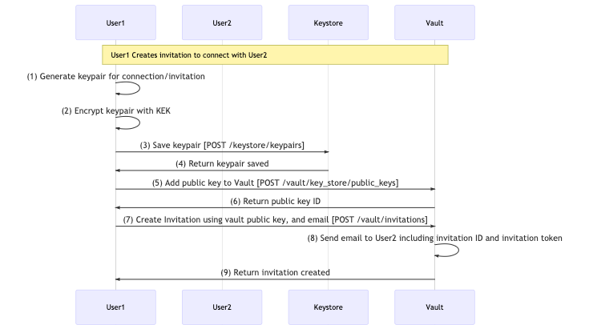
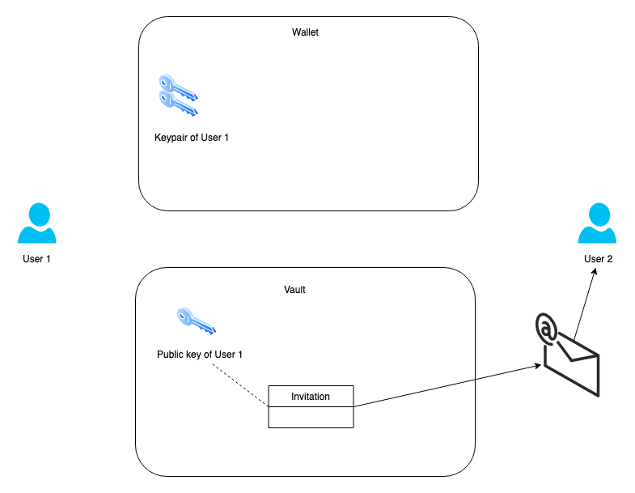
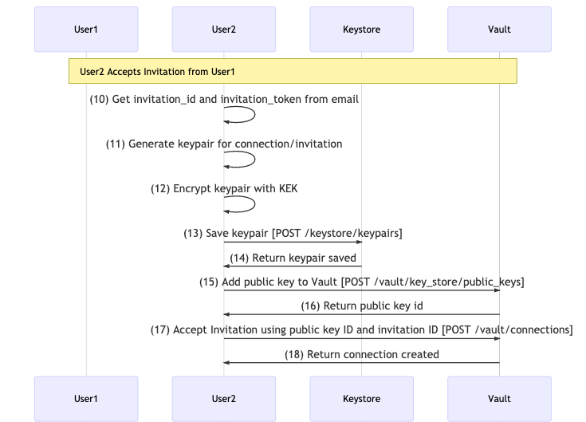
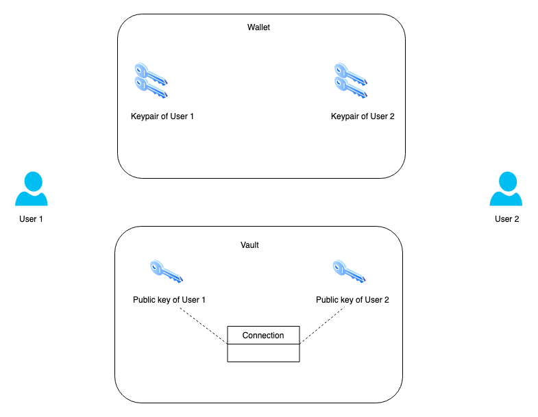
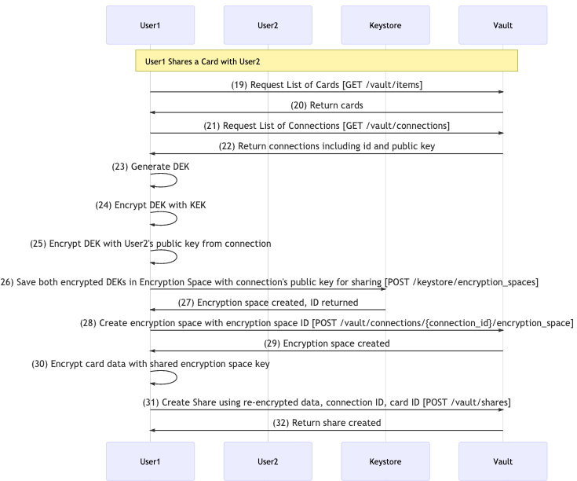
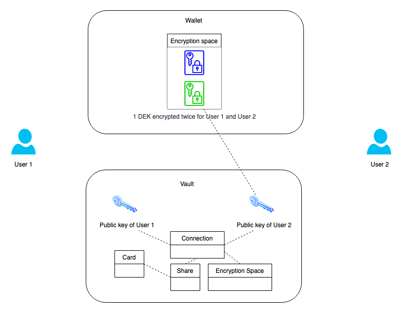
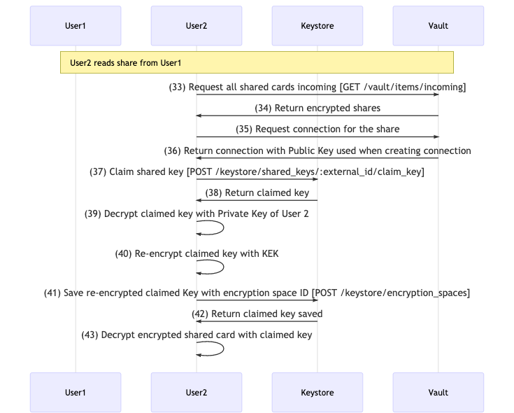

# Connections And Sharing

## Sharing Cards Between Users

All user data stored in the Vault is encrypted and can only be decrypted and read by the user.

Howerver, the Meeco platform makes it possible for one user to share cards with another user. We will cover this process and its steps in this guide.

In summary, the sharer will generate a DEK (data encryption key) specifically for the purpose of this share and re-encrypt the shared card with this key. In order to share the DEK, Public Key cryptography is used: the sharer will encrypt the DEK with a Public Key of the share recipient, so only the share recipient can decrypt the DEK with their Private Key, and then use the DEK to decrypt the card.

Let's dive into it.

### Invitation To Connect

Before anything can be shared, 2 Users need to establish a _connection_. In order to create a connection in this example, User 1 will invite User 2.

The process can be described in the following sequence diagram:

At step (1) User 1 generates a Keypair which will be used for inviting another user, and later for the key exchange.

Steps 2-4 are part of the standard procedure used for storing Keypairs in the Keystore. If there is a Keypair, it is encrypted by the Key Encryption Key (KEK) and stored in the Keystore. Please read guide Setting Up Access to the Vault and Keystore `02.setting_up_access_to_the_vault_and_keystore.md` if you haven't done read it yet.

In steps 5 and 6, User 1 stores the Public Key. In steps 7-9 User 1 creates an invitation using the following as input:

- email of the user that User 1 wants to connect to (User 2)
- the ID of the Public Key stored in step 5

In step 8 the Vault sends an invitation email to User 2.

### Accepting Invitation

In this section we'll describe the scenario when User 2 accepts the invitation from User 1.

This process can be described in the following sequence diagram:

Most of these steps are the the same steps of User 1 in the previous section: just like User 1, User 2 generates a Keypair for this connection (step 11), encrypts it and stores in the Keystore (steps 12-14), and publishes the Public Key in the Vault (steps 15-16).

The most important step is a call to create a connection as step 12. The parameters of the call are the invitation ID and the invitation token.

The most important results after these two sections are as follows:

- The connection between User 1 and User 2 has now been established
- User 1 has access to the Public Key of User 2 via the connection record
- User 2 has access to the Public Key of User 1 via the connection record

### Creating A Share

In this section, to create a share, User 1 will generate a DEK dedicated to this share, re-encrypt a card and store it as a share, and share the DEK with User2, encrypted by the Public Key of User 2.

The process of encryption and the key exchange is abstracted into something called _Encryption Space_. An encryption space exists both in the Keystore and the Vault and both records share the same ID. The function of the encryption space in the Keystore is key exchange. The function of the encryption space in the Vault is a way to point to the correct encryption space in the Keystore for a given connection.

Creation of a share can be described in the following sequence diagram:

At step 23 User 1 generates a DEK. This DEK will be used to encrypt the shared card. As we always do with DEKs, we encrypt it the Key Encryption Key (step24). But we also need to have the key readable by User 2, so at step 25 we encrypt the same KEK by the Public Key of User 2.

At steps 26 and 27 an encryption space is created in the Keystore, containing two versions of the same DEK, one only readable by User 1, the other one only readable by User 2.

In steps 28-29 an encryption space is created in the Vault with the same ID as the encryption space in the Keystore. The encryption space in the Vault is linked to the connection record.

In steps 30-31 User 1 encrypts the card data with the shared DEK and creates a Share record

The main results of these steps are as follows:

- A DEK has been created waiting to be claimed by User 2
- This DEK is wrapped in an Encryption Space
- A Share record has been created in the Vault, and it is linked to the connection between User 1 and User 2
- An Encryption Space in the Vault is a link between the connection and the Encryption Space in the Keystore

### Reading The Share

Reading of the share can be described in the following sequence diagram:

First in step 33 User 2 retrieves a list of all incoming shares. Each share has a connection ID.

If there is a new share User 2 needs to decrypt and read, in step 35 User 2 requests the connection for the share.

Once the ID of the encryption space is known, User 2 retrieves the DEK in steps 37-38, decrypts it with their Private Key in step 39 and decrypts the share in step 43.

As it is always done with keys, this DEK is encrypted with the Key Encryption Key (KEK) of User 2 and stored in the Keystore in steps 40-42
